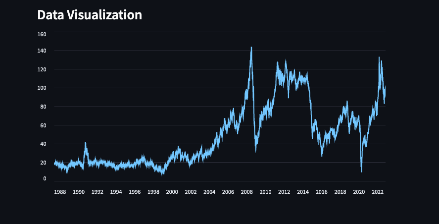

# Data Visualization Streamlit App

This repository contains a simple data visualization Streamlit app that allows users to upload CSV data and create various types of plots. The app provides options for date column selection, date filtering, and different plot types, including line plots, bar charts, and scatter plots.

## Requirements

To run the Streamlit app, you'll need to have Python and the necessary libraries installed. You can install the required packages using pip:

```bash
pip install -r requirements.txt
```

## Getting Started

1. Clone this repository:

```bash
git clone https://github.com/dianepaul/data-visualization-tool.git
cd data-visualization-tool
```

2. Install the required packages as mentioned in the "Requirements" section.

3. Run the Streamlit app:

```bash
streamlit run app.py
```

The app will launch in your default web browser, and you can start using it.

## Usage

### File Upload

- Click on the "Upload a CSV file" button to upload your CSV data.

Here is the link to the Kaggle page where you will find the BrentOilPrices.csv file I used to obtain the results below : 
https://www.kaggle.com/datasets/mabusalah/brent-oil-prices?resource=download

### Date Column Selection

- Use the "Select the Date Column" dropdown to specify the date column for datetime conversion.

### Date Filtering

- Enable the "Enable Date Filter" checkbox to filter data based on a date range.
- Use the "Start Date" and "End Date" date pickers to set the date range.

### Plot Type Selection

- Choose a plot type from the "Select a plot type" dropdown.
- Available plot types: Line Plot, Bar Chart, Scatter Plot.

### Raw Data Display

- The app displays the raw data from the uploaded CSV file.

### Data Visualization

- Depending on the selected plot type, the app generates and displays the corresponding data visualization.

#### Results



## Contributing

If you'd like to contribute to this Streamlit app, please follow these steps:

1. Fork this repository.
2. Create a new branch for your feature: `git checkout -b feature-name`.
3. Make your changes and commit them: `git commit -m 'Add feature'`.
4. Push to the branch: `git push origin feature-name`.
5. Create a pull request.

